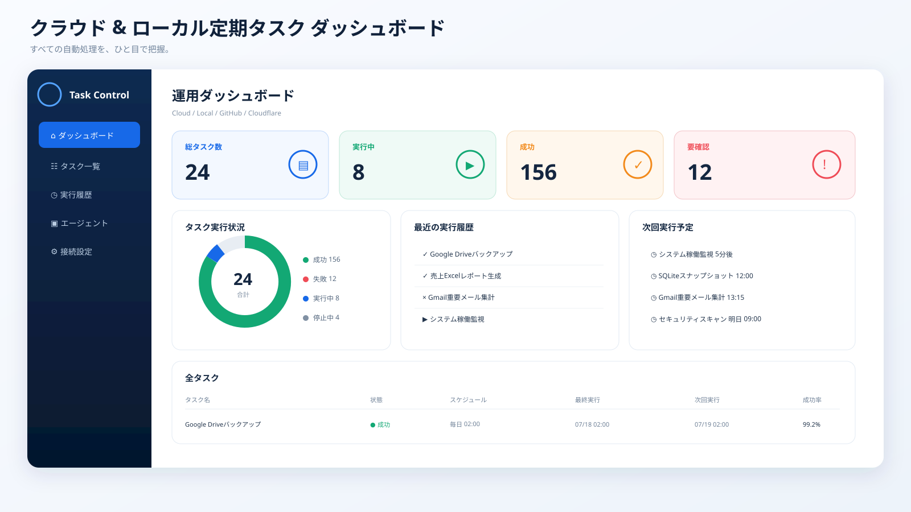
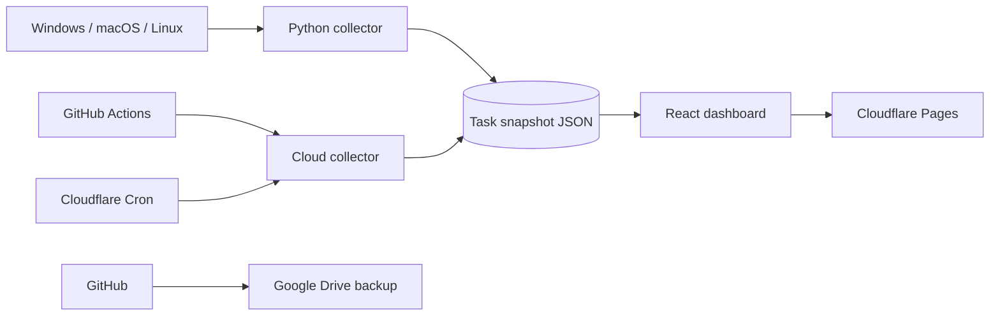

# Cloud & Local Task Dashboard


> GPT Imageで作成した画面コンセプトをもとに、同じ情報設計・配色・レスポンシブ構成で実装した定期タスク統合ダッシュボードです。

<p align="center"></p>

## Production

- **Dashboard:** https://cloud-local-task-dashboard.pages.dev
- **Health:** https://cloud-local-task-dashboard.pages.dev/api/health
- **Snapshot:** https://cloud-local-task-dashboard.pages.dev/data/tasks.json
- **Branch:** `main`

## What it does

- Windows Task Scheduler、cron、systemd timers、launchdを収集
- GitHub ActionsとCloudflare Workers Cron Triggersを収集
- 成功・失敗・実行中・停止中、次回実行、成功率、接続元を一画面に統合
- PCとスマートフォンに対応
- 60秒ごとの画面更新、クラウド15分間隔、ローカル5分間隔
- GitHub Actionsでテスト、ビルド、成果物アップロード
- Cloudflare Pagesへ本番公開
- Google Driveへリポジトリ全体を自動同期

## Architecture



Detailed design: [docs/architecture.md](docs/architecture.md)  
Initial setup: [docs/setup.md](docs/setup.md)

## Development

```bash
npm install
npm run dev
```

```bash
npm run lint
npm test
npm run build
python -m unittest discover -s agent -p 'test_*.py'
```

## Production requirements

The demo needs no secret. Real cloud collection uses only the secret names documented in `docs/setup.md`. Local publishing uses a repository-scoped fine-grained GitHub token kept on that machine. Put Cloudflare Access in front of the custom domain before publishing sensitive task metadata.

## Project map

- `src/` — React dashboard
- `agent/` — cross-platform collectors
- `scripts/` — one-command agent installers
- `functions/api/health.ts` — Pages health endpoint
- `.github/workflows/ci.yml` — CI and 15-minute cloud collection
- `docs/architecture.md` — architecture and data flow
- `docs/setup.md` — initial connection guide
