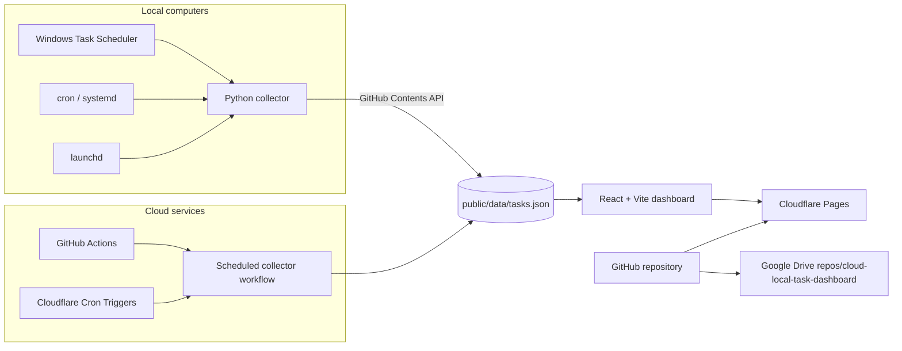

# Architecture

## Overview

Task Control Center is a read-only operations dashboard. A cross-platform Python agent discovers local scheduled tasks, while GitHub Actions collects cloud schedules. Both produce the same redacted JSON snapshot consumed by the React application.

## Data flow

1. Collectors normalize each scheduler into `ScheduledTask` records.
2. Sensitive command details are redacted by default.
3. A JSON snapshot is committed to `public/data/tasks.json`.
4. Cloudflare Pages rebuilds the dashboard after a snapshot commit.
5. The browser refreshes the snapshot every 60 seconds.

## Components

- **Frontend:** React 19, TypeScript, Vite, responsive CSS.
- **Local collector:** Python standard library; Windows, Linux and macOS.
- **Cloud collector:** GitHub Actions and optional Cloudflare API collection.
- **Persistence:** Versioned JSON snapshot in GitHub. This keeps deployment simple and auditable.
- **CI/CD:** GitHub Actions runs TypeScript checks, Vitest, Python tests, production build and artifact upload.
- **Deployment:** Cloudflare Pages on `main`.
- **Backup:** Full repository mirrored to Google Drive.

## Security

The published site is read-only. Tokens stay in the local environment or GitHub Secrets and are never written to snapshots. Task commands should remain redacted when the Pages site is public. For private operational details, add Cloudflare Access in front of the Pages project.

## Extension points

Collectors can be added for AWS EventBridge, Google Cloud Scheduler, Azure Automation, Kubernetes CronJobs, Zapier, Make and n8n by returning the same task schema.
